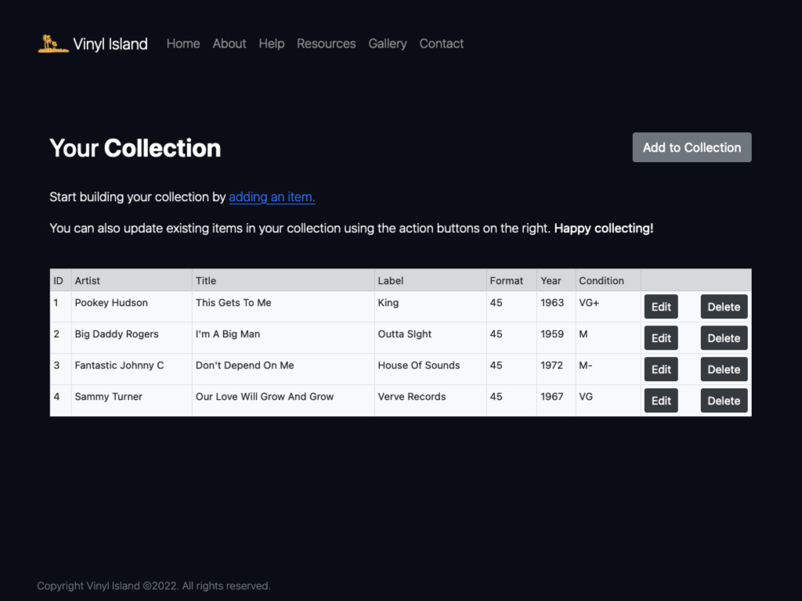

# Vinyl Island Project
Final Project For QA DevOps Bootcamp

##  Introduction

### Contents:

* P1:
* P2:
* P3:
* P4:
* P5:
* P6:
* P7:
* P8:
* P9:
* P10:
* P11:
* P12:
* P13:

## Screen video recordings
* Show usage of the app
* Show update through Git to pipeline
* Show Jenkins pipeline completing

 |  | 

-----

## Technologies Used

##### PROJECT MANAGEMENT
* Agile/Sprints
* Jira

---
##### SOFTWARE DESIGN
* Programming/software development
* Version Control
* Git
* Programming/software development
* Python/Flask
* Database
* MySql, SQLite
---
##### TESTING
* Unit Testing
* Pytest
---

##### PIPELINE
* Manage VMs
* Linux
* Git
* Jenkins
* Docker/Docker Compose
* Docker Swarm
---

