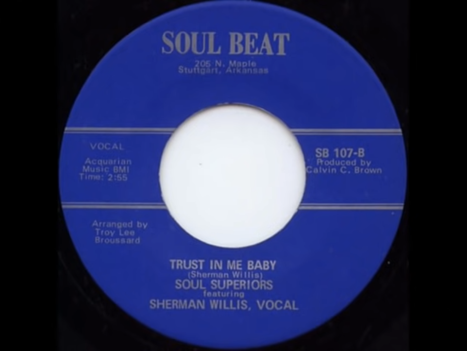

# Vinyl Island Project
Final Project For QA DevOps Bootcamp

##  Introduction

### Contents:

* P1:
* P2:
* P3:
* P4:
* P5:
* P6:
* P7:
* P8:
* P9:
* P10:
* P11:
* P12:
* P13:

---

##### THE PROJECT

This project aims to create an intuitive application to create and manage a collection of vinyl records. It could be easily adapted for any type of collection.

This current version has the basic CRUD functionality with which the user can create a collection, add items to the collection, edit or delete those items.

Additional features have been included in the Jira backlog. These features include login/authentication, share collections with friends, add links to sound files (mp3), a wants list that will allow the user to search existing vinyl market places for items on their wants list. A feature to allow an image to be added to each record.

##### Quick Look

    

---

## Screen video recordings

* Show usage of the app
* Show update through Git to pipeline
* Show Jenkins pipeline completing

  

---

##### PROJECT MANAGEMENT
* Agile/Sprints
* Jira

Jira was used to plan and keep track of the app development. User stories were developed to determine the functionalities of the app. Some of the user stories developed were as follows:

    As a user, I want to categorize my expenses, so that I can know where do I spend most
    As a user, I want to add my expense item, so that I can view them later
    As a user, I want to edit my expenses, so that I can rectify mistakes

Each user story was assigned a story point estimate and then assigned to an epic. Sprints were conducted lasting 1 week each and where the story points were assigned to the sprints. The backlog of the remaining issues was cleared with each sprint session.

   

---
##### SOFTWARE DESIGN
* Programming/software development
* Version Control
* Git
* Programming/software development
* Python/Flask
* Database
* MySql, SQLite
---
##### TESTING
* Unit Testing
* Pytest
---

##### PIPELINE
* Azure VMs
* Ubunto/Linux
* Git and Github
* Jenkins
* Docker/Docker Compose
* Nginx
---

The app was deployed using a CI/CD pipeline. The tools and technologies used for maintaining the pipeline and deployment are:

 
---
